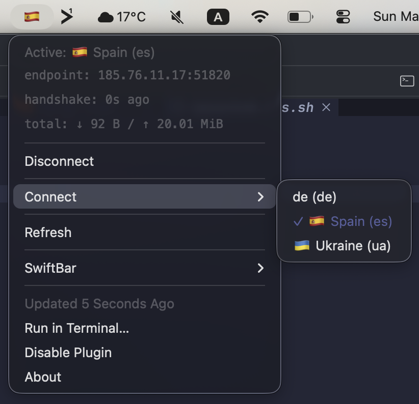
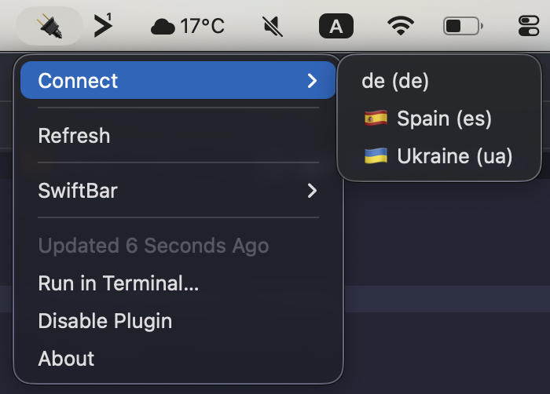
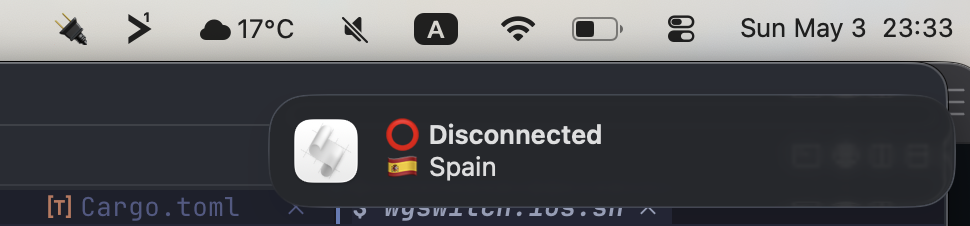

# wgswitch

A thin wrapper around `wg-quick` for fast WireGuard profile switching from
launchers (Raycast, LeaderKey, Alfred, custom hotkeys) with a JSON `status`
command for status bars (waybar, SwiftBar, etc.).

`wgswitch` is intentionally small. It does not parse, write, or generate
WireGuard configs — `wg-quick` already does that. It does not bundle a status
bar widget — it emits JSON, you write the thin layer for *your* bar in bash /
python / whatever. What it does is be safe to wire up to `sudoers NOPASSWD`
and pleasant to call from a launcher.

## Commands

```sh
wgswitch list                          # discovered profiles + metadata
wgswitch connect <profile>             # bring up a profile (auto-downs others)
wgswitch off [profile]                 # down one, or all active if no name
wgswitch status [--format json|text]   # current state + transfer + rates
wgswitch --notify connect <profile>    # also fire a desktop notification
```

All commands need root: `connect` / `off` go through `wg-quick`, `status` calls
`wg show`, and `list` reads `/etc/wireguard/` which is `0700 root:root` on
both macOS and Linux. Wire them up via sudoers `NOPASSWD` (see below) so
launchers and bar widgets can call them without prompting.

## Install

```sh
cargo install wgswitch
```

This drops the binary at `~/.cargo/bin/wgswitch`. It works fine for direct
terminal use, but if you plan to wire it up to **`sudoers NOPASSWD`**
(below), copy it into a root-owned location first:

```sh
sudo mkdir -p /usr/local/bin   # may not exist by default on Apple Silicon
sudo install -m 755 -o root ~/.cargo/bin/wgswitch /usr/local/bin/wgswitch
```

> **Why:** a `sudoers NOPASSWD` rule pointing at a user-writable path is a
> privilege-escalation primitive — any `cargo install --force` would
> replace the binary with arbitrary code that then runs as root. Always
> point sudoers at a path the user can't overwrite.

`wg` and `wg-quick` are looked up only in trusted absolute paths
(`/usr/bin`, `/usr/local/bin`, `/opt/homebrew/bin`, `/sbin`, `/usr/sbin`).

## Setup

WireGuard configs are read from the standard locations:

- `/etc/wireguard/<name>.conf`
- `/usr/local/etc/wireguard/<name>.conf` (Intel Homebrew)
- `/opt/homebrew/etc/wireguard/<name>.conf` (Apple Silicon Homebrew)

Profile id = the `.conf` filename without extension. Names are validated as
`[a-zA-Z0-9_=+.-]{1,15}` — same regex `wg-quick` uses for interface names.

### Optional metadata

`wgswitch` looks for a JSON file in this order:

1. `--config <path>` if passed
2. `/etc/wgswitch.json`
3. `/usr/local/etc/wgswitch.json`
4. `~/.wgswitch.json`

Schema is **display-only** — there are deliberately no fields for paths or
binary overrides:

```json
{
  "profiles": {
    "es": { "label": "Spain",   "description": "", "emoji": "🇪🇸" },
    "ua": { "label": "Ukraine", "description": "", "emoji": "🇺🇦" }
  }
}
```

The file must not be world-writable, and (when `wgswitch` runs as root) must
be owned by root or the calling user — same hardening as `wg-quick`.

## Example: ProtonVPN

ProtonVPN exposes per-server WireGuard configs through their dashboard.
Wiring up two of them (here: Spain and Ukraine) end-to-end:

1. Sign in at <https://account.protonvpn.com/downloads> and open the
   **WireGuard configuration** tab.
2. For each server you want, pick the feature flags you care about
   (NetShield, P2P, secure-core, etc. — `wgswitch` does not care, that
   is `wg-quick`'s job) and download the `.conf` file.
3. Move the files into `/etc/wireguard/`, renaming them to short ids
   that match `[a-zA-Z0-9_=+.-]{1,15}`. The id you save under is what
   you'll later pass to `wgswitch connect`:

   ```sh
   sudo install -m 600 -o root -g wheel ~/Downloads/ES-FREE-1.conf  /etc/wireguard/es.conf
   sudo install -m 600 -o root -g wheel ~/Downloads/UA-FREE-12.conf /etc/wireguard/ua.conf
   ```

   On Linux replace `wheel` with `root`. On Apple Silicon Homebrew you
   may want `/opt/homebrew/etc/wireguard/` instead — `wgswitch` checks
   all three locations.

4. Drop the display metadata so launchers and the bar widget render
   flags + readable labels:

   ```sh
   sudo tee /etc/wgswitch.json >/dev/null <<'JSON'
   {
     "profiles": {
       "es": { "label": "Spain",   "emoji": "🇪🇸", "description": "ProtonVPN" },
       "ua": { "label": "Ukraine", "emoji": "🇺🇦", "description": "ProtonVPN" }
     }
   }
   JSON
   sudo chmod 644 /etc/wgswitch.json
   ```

5. Verify:

   ```sh
   sudo wgswitch list
   # es               🇪🇸 Spain
   # ua               🇺🇦 Ukraine

   sudo wgswitch --notify connect es
   sudo wgswitch status --format json | jq .current   # → "es"
   sudo wgswitch connect ua                            # auto-downs es first
   sudo wgswitch off                                   # drops everything
   ```

Adding more ProtonVPN exits later is just step 2 + a new entry in
`/etc/wgswitch.json`. The ids you pick are arbitrary — `es-fast`,
`uk-p2p`, `de-sc` all work as long as they fit the regex.

## Sudoers

Most launchers can't pop a password prompt, so add a passwordless rule for
the operations that need root. Drop it into `/etc/sudoers.d/wgswitch` rather
than editing the main `/etc/sudoers`:

```sh
sudo tee /etc/sudoers.d/wgswitch >/dev/null <<'SUDOERS'
%admin ALL=(root) NOPASSWD: /usr/local/bin/wgswitch connect *, \
                            /usr/local/bin/wgswitch off, \
                            /usr/local/bin/wgswitch off *, \
                            /usr/local/bin/wgswitch list*, \
                            /usr/local/bin/wgswitch status*
SUDOERS
sudo chmod 440 /etc/sudoers.d/wgswitch
sudo visudo -cf /etc/sudoers.d/wgswitch
```

`visudo -cf` parses the file and refuses to lock you out if the syntax is
wrong — always run it before logging out. Adjust path and group to your
system (on Linux the admin group is usually `sudo` or `wheel`).

## LeaderKey

[LeaderKey](https://github.com/mikker/LeaderKey) is a chord launcher for
macOS — its `config.json` is a tree of groups + actions. Drop a `v` group
into yours so `<leader> v u` connects Ukraine, `<leader> v e` connects
Spain, `<leader> v o` drops everything. The trailing
`open "swiftbar://refreshallplugins"` nudges SwiftBar to redraw the menubar
immediately instead of waiting for the next poll.

```json
{
  "type": "group",
  "actions": [
    {
      "key": "v",
      "type": "group",
      "actions": [
        {
          "key": "u",
          "type": "command",
          "value": "sudo /usr/local/bin/wgswitch connect ua --notify && open \"swiftbar://refreshallplugins\""
        },
        {
          "key": "e",
          "type": "command",
          "value": "sudo /usr/local/bin/wgswitch connect es --notify && open \"swiftbar://refreshallplugins\""
        },
        {
          "key": "o",
          "type": "command",
          "value": "sudo /usr/local/bin/wgswitch off --notify && open \"swiftbar://refreshallplugins\""
        }
      ]
    }
  ]
}
```

Relies on the sudoers `NOPASSWD` rule above so `sudo` doesn't prompt.

## Status JSON

```sh
sudo wgswitch status --format json
```

```json
{
  "current": "ua",
  "active": ["ua"],
  "profiles": [
    {
      "id": "ua",
      "label": "Ukraine",
      "emoji": "🇺🇦",
      "active": true,
      "interface": { "public_key": "…", "listen_port": 51820 },
      "totals": {
        "rx_bytes": 12345678,
        "tx_bytes": 234567,
        "rx_human": "11.77 MiB",
        "tx_human": "229.07 KiB",
        "rx_per_sec": 1024,
        "tx_per_sec": 256,
        "rx_per_sec_human": "1.00 KiB/s",
        "tx_per_sec_human": "256 B/s"
      },
      "peers": [
        {
          "public_key": "…",
          "endpoint": "1.2.3.4:51820",
          "allowed_ips": "0.0.0.0/0",
          "last_handshake": 1714750000,
          "last_handshake_ago_seconds": 30,
          "last_handshake_ago_human": "30s ago",
          "rx_bytes": 12345678,
          "tx_bytes": 234567
        }
      ]
    },
    { "id": "es", "label": "Spain", "emoji": "🇪🇸", "active": false }
  ]
}
```

`top-level.current` is the single active profile id, or `null` when zero or
more than one are up.

Transfer-rate fields (`rx_per_sec`, `tx_per_sec`, and their `*_human`
companions) are a delta against the previous `status` invocation, cached at
`/var/run/wgswitch/state.json` (mode `0600`, root-owned). Outside the
`50ms..10min` window the rate fields are omitted from the JSON entirely
(useful so a bar polling once per hour doesn't show a fake speed).

All optional fields use `skip_serializing_if`, so absent values are missing
keys, not `null`. Inactive profiles only carry `id`, `label`, `description`,
`emoji`, `active: false`.

### Bar integration

You write the thin layer; `wgswitch` only emits raw JSON.

- **SwiftBar / xbar**: a working example lives in
  [`scripts/wgswitch.10s.sh`](scripts/wgswitch.10s.sh) — copy it into
  `~/Library/Application Support/SwiftBar/Plugins/`, `chmod +x`, and SwiftBar
  refreshes it every 10 seconds. The menubar shows the active flag plus
  current ↑/↓ rate; the dropdown lists totals, last handshake, endpoint, a
  *Disconnect* action, and a *Connect* submenu with one entry per profile.
  Requires `jq` and the sudoers NOPASSWD rule above. Override binary paths
  via `WGSWITCH=` / `SUDO=` env vars in the SwiftBar plugin config if your
  install lives somewhere other than `/usr/local/bin`.

  | Connected | Disconnected |
  | --- | --- |
  |  |  |
- **waybar custom module**: call `sudo wgswitch status --format json`,
  project into `{ "text": "...", "tooltip": "..." }` via a small wrapper.

## Notifications

```sh
sudo wgswitch --notify connect ua
```

Titles are fixed: `✅ Connected`, `⭕ Disconnected`, `🆘 Error`. Body is
`<emoji> <label>` plus `description` if present.



- macOS: `osascript`. When run under sudo, `wgswitch` re-enters the calling
  user's UI session via `sudo -u $SUDO_USER` so the banner is delivered to
  them, not to root (NotificationCenter is per-user).
- Linux: `notify-send` with the same `sudo -u` trick. The user session must
  have `DBUS_SESSION_BUS_ADDRESS` reachable; sudoers configurations that
  strip the env may need to allow it through.

If neither program is found, the notification is silently dropped — it never
fails the underlying connect/disconnect.

## Security

`wgswitch` is designed to be safe to install in `sudoers` with `NOPASSWD`.
To prevent privilege escalation through the wrapper:

- The profile argument is a strict id (`[a-zA-Z0-9_=+.-]{1,15}`); no slashes,
  no `..`, no shell metacharacters. The `.conf` path is built from a fixed
  directory + the validated id, never from user input.
- Binary paths for `wg`, `wg-quick`, `osascript`, `sudo`, and `notify-send`
  come from a hardcoded list of trusted absolute paths — they are never read
  from `$PATH` or from the JSON config.
- The JSON config carries display metadata only. There is no way to override
  binary or `.conf` paths through it, so an attacker who can write
  `~/.wgswitch.json` cannot escalate.
- Config-file ownership and mode are checked before reading: refused if
  world-writable, or if owned by an unexpected uid when `wgswitch` runs as
  root (must be root, the calling euid, or `$SUDO_UID`).

## License

Dual-licensed under MIT or Apache-2.0, at your option.
